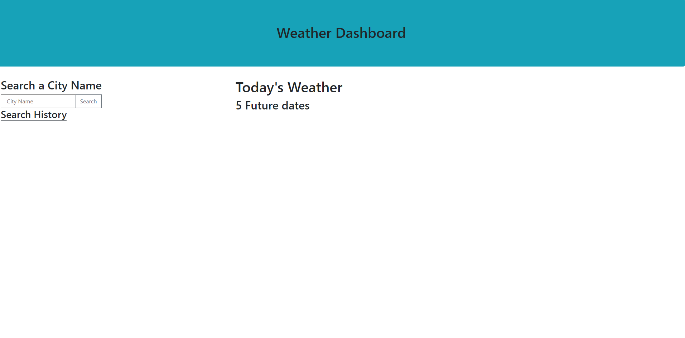

# Weather-Dashboard
Weather dashboard that displays 6 total days of weather (with details) for a selected city. Displays multiple details such as the date, temperature, the wind speed, the humidity, and an icon for the forecast. 

To the side there is a search history list which displays previous searches as buttons that will run the original weather function with that button's stored value.

I was unable to complete the functions that would display weather data at this time.

https://neft-tk.github.io/Weather-Dashboard/

## Installation
N/A

## Usage

Uses two API fetch requests, one to get coordinates for a city and another to use said coordinates to get the weather data for that city. Uses bootstrap for a CSS framework.

## Credits
N/A

## License
Please refer to the LICENSE in the repo.

